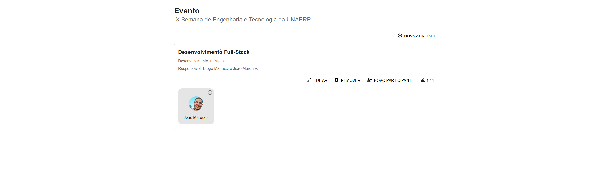
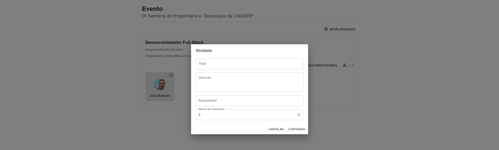
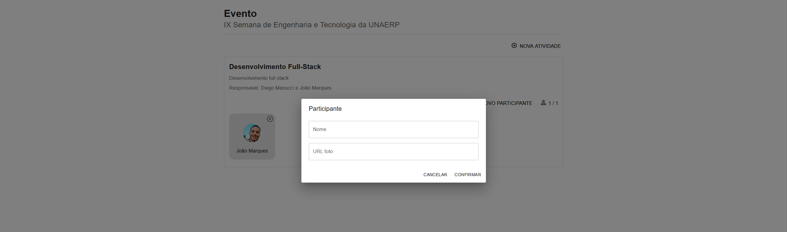

# Minicurso Desenvolvimento Full Stack

---
## O que é Desenvolvimento Full Stack?

### 🌐 Desenvolvimento Full Stack

Desenvolvimento Full Stack refere-se à habilidade de trabalhar tanto no **front-end** quanto no **back-end** de uma aplicação web.

- **Front-End**: A parte da aplicação que os usuários interagem diretamente.
- **Back-End**: O lado do servidor da aplicação, responsável por lógica, banco de dados, autenticação e APIs.

### O Desenvolvedor Full Stack é um 🦆

Assim como o pato não é especialista em nenhum desses modos de locomoção (andar, nadar e voar), o desenvolvedor full stack também não é especialista em uma única área. Sua característica principal é a versatilidade.

---
## 🏹 O Profissional em "T" 

Um desenvolvedor full stack precisa equilibrar a generalização de conhecimento com a especialização em uma área. Esse é o conceito do profissional em "T".

Ele tem uma base ampla em front-end e back-end (o topo do "T"), mas também se especializa em uma área específica (o tronco do "T").

Isso permite que atue eficazmente em todas as etapas do desenvolvimento de software, enquanto oferece um alto nível de especialização quando necessário.

---
## 🔍 Preview da Aplicação Final
Ao final do minicurso, teremos desenvolvido uma aplicação web completa para a semana de engenharia.
Passando por vários pontos importantes e do dia a dia de um desenvolvedor web.

- RESTful
- CORS
- HTTPS
- Arquitetura MSC
- Reatividade
- Ciclo de vida do React
- E muito mais!

Algumas imagens da aplicação

--

--

--
## ⚙️ Primeiro dia
###  Desenvolvimento Back-End com Spring 🌱

Hoje, durante o primeiro dia do nosso minicurso, vamos mergulhar na construção do back-end de uma mini aplicação para a semana de engenharia.

Usando o framework Spring e a linguagem Java na versão 17, aprenderemos a criar APIs RESTful e suas boas práticas. Vamos abordar desde a configuração inicial do projeto até a implementação de endpoints para lidar com diferentes operações, como criar, ler, atualizar e excluir dados `[CRUD]`

Ao final do primeiro dia do minicurso, esperamos ter uma base sólida para o `back-end` de nossa aplicação e estaremos prontos para avançar para a próxima etapa do desenvolvimento: `front-end`.

**Codeshare** https://codeshare.io/minicurso-fullstack 💻

---
### Spring Initializr 💡
Vamos iniciar nosso projeto utilizando o Spring Initializr
- URL: [Spring Initializr](https://start.spring.io/)
- Dependências: Spring boot, Spring JPA, h2, validations, lombok

## 🖌️ Segundo dia
### Desenvolvimento Front-End com React ✨

**Vamos nos conectar!**

- [LinkedIn](URL_DO_SEU_LINKEDIN)
- [GitHub](URL_DO_SEU_GITHUB)
